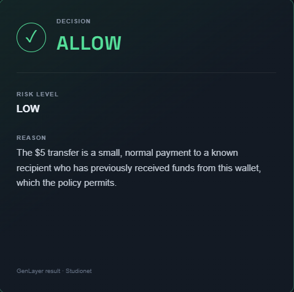
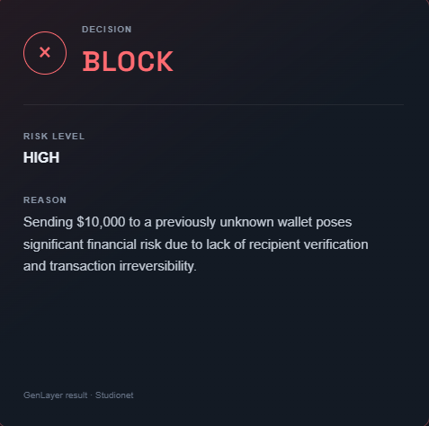
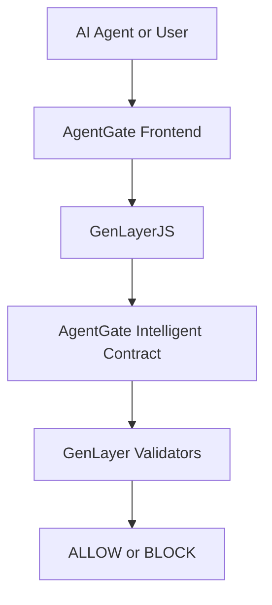

# AgentGate

A GenLayer-powered trust layer for autonomous AI agents.

Before an autonomous agent performs a high-impact action, AgentGate asks GenLayer validators to evaluate the proposed action using its context and a human-defined policy. It returns an `ALLOW` or `BLOCK` decision, a `LOW`, `MEDIUM`, or `HIGH` risk level, and a short human-readable reason.

**Input:** `action`, `context`, `policy`

**Output:** `ALLOW` / `BLOCK`, `risk`, `reason`

## Demo

These screenshots show the two confirmed outcomes from the deployed GenLayer Studionet workflow.

| `ALLOW` / `LOW` | `BLOCK` / `HIGH` |
| --- | --- |
|  |  |

### Example 1: Routine Payment

**Action:** Send $5 to a known wallet.

**Context:** Recipient has received payments from this wallet multiple times.

**Policy:** Normal small payments to known recipients are allowed.

**Result:** `ALLOW` / `LOW`

### Example 2: High-Risk Transfer

**Action:** Send $10,000 to a new wallet.

**Context:** The wallet has never interacted with this recipient.

**Policy:** Large transfers to unknown recipients should be blocked.

**Result:** `BLOCK` / `HIGH`

## Problem

Traditional rule engines work well when every condition is deterministic. Autonomous agents increasingly operate in situations shaped by ambiguity, intent, contextual risk, and incomplete information. These situations cannot always be handled safely by adding another hard-coded `if/else` branch.

Agents need a way to evaluate consequential actions using the surrounding circumstances, not only static permission lists.

## Solution

AgentGate acts as a judgment layer before an autonomous agent performs a consequential action:

```text
AI Agent
  -> AgentGate
  -> GenLayer Intelligent Contract
  -> GenLayer Validators
  -> ALLOW / BLOCK
```

The agent supplies an action, context, and policy. AgentGate evaluates them through its Intelligent Contract and exposes the accepted decision to the calling application.

## Why GenLayer

AgentGate is not a frontend wrapper around a centralized LLM API. A centralized policy service would ask one model for an answer and require the application to trust that provider and response directly.

GenLayer makes subjective AI judgment part of an Intelligent Contract execution and validator consensus process. In AgentGate, the leader produces a structured evaluation, while validators independently evaluate the same action, context, and policy. Agreement focuses on the decision and risk fields that control the outcome.

```text
Traditional policy engine:
deterministic rule -> deterministic output

AgentGate:
action + context + policy
  -> decentralized AI judgment
  -> validator agreement
  -> decision
```

This approach is useful when autonomous agents must make contextual trust decisions that cannot be fully expressed as deterministic rules.

## How It Works

1. A user or AI agent proposes an action.
2. AgentGate receives three inputs: `action`, `context`, and `policy`.
3. The Intelligent Contract asks an LLM for a structured evaluation through GenLayer nondeterministic execution.
4. Validators independently evaluate the proposed judgment.
5. Validator agreement focuses on `decision` and `risk`; explanations may use different wording.
6. The accepted result is stored in the contract.
7. The frontend reads and displays `decision`, `risk`, and `reason`.

The output has this shape:

```json
{
  "decision": "ALLOW | BLOCK",
  "risk": "LOW | MEDIUM | HIGH",
  "reason": "A short human-readable explanation"
}
```

## Architecture



| Layer | Technology |
| --- | --- |
| Frontend | React + Vite |
| SDK | `genlayer-js` |
| Contract | GenLayer Intelligent Contract |
| Wallet | MetaMask + GenLayer Wallet Plugin |
| Network | GenLayer Studionet |
| Chain ID | `61999` |

## Deployment

- **Network:** GenLayer Studionet
- **Chain ID:** `61999`
- **Contract address:** Not included in tracked/public configuration. Insert the deployed public AgentGate address here before publishing the final submission.

## Intelligent Contract

The contract is implemented in [`contracts/agent_gate.py`](contracts/agent_gate.py).

- Write method: `evaluate_action(action, context, policy)`
- Read method: `get_last_evaluation()`

The contract does not use hard-coded business rules to choose `ALLOW`, `BLOCK`, or a risk level. It uses `gl.nondet.exec_prompt` for contextual AI evaluation and `gl.vm.run_nondet_unsafe` for validator-based nondeterministic execution. It also validates the exact result fields, permitted values, and reason length before storing an evaluation.

## Testing

The Direct Mode test suite is located in [`tests/direct/`](tests/direct/). It covers representative action-policy scenarios, malformed AI responses, and validator agreement and disagreement.

```bash
pytest tests/direct/ -v
```

```text
10 passed
0 failed
```

## Run Locally

Install and start the frontend:

```bash
cd frontend
npm install
npm run dev
```

Open [http://localhost:5173](http://localhost:5173).

Create `frontend/.env` from `frontend/.env.example` and set the deployed public contract address:

```dotenv
VITE_AGENTGATE_CONTRACT_ADDRESS=
```

Real write transactions require MetaMask, the GenLayer Wallet Plugin, GenLayer Studionet, and test GEN for transaction fees. Never place private keys, seed phrases, or wallet secrets in frontend environment files.

## Project Structure

```text
AgentGate/
|-- contracts/
|   `-- agent_gate.py
|-- tests/
|   `-- direct/
|       `-- test_agent_gate.py
|-- frontend/
|   |-- src/
|   |   `-- genlayer.js
|   |-- .env.example
|   `-- package.json
|-- docs/
|   |-- allow-demo.png
|   `-- block-demo.png
`-- README.md
```

## Current Status

**MVP status: Working**

Confirmed:

- Intelligent Contract deployed to GenLayer Studionet
- Direct Mode tests passing
- MetaMask and GenLayer Wallet Plugin integration
- Real Studionet transaction submission
- Validator evaluation
- `ALLOW` result
- `BLOCK` result
- `LOW`, `MEDIUM`, and `HIGH` risk classification support
- Human-readable reasoning displayed in the frontend

AgentGate is a working hackathon MVP and does not claim production readiness.

## Future Improvements

- Reusable policy templates
- Richer agent identity and action context
- Policy versioning
- Evaluation and transaction history
- Integrations with external autonomous agent frameworks
- Improved monitoring and operational visibility

## Hackathon Thesis

Autonomous agents need more than permission lists.
They need contextual judgment before acting.

AgentGate explores how GenLayer can provide that judgment layer.
